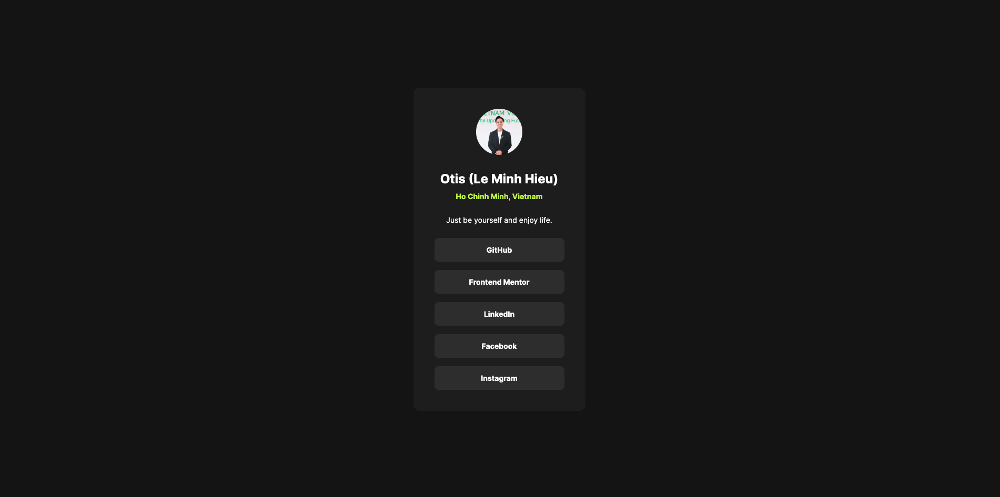

# Social Links Profile (Frontend Mentor Challenge)

Solution for the [Frontend Mentor Social Links Profile challenge](https://github.com/leminhhieu98py/Frontend-Mentor___Social-links-profile).

## Table of Contents

- [Overview](#overview)
  - [Screenshot](#screenshot)
  - [Links](#links)
- [Features & Tech Stack](#features--tech-stack)
- [Getting Started](#getting-started)
- [Development Workflow](#development-workflow)
- [Troubleshooting](#troubleshooting)
- [Author](#author)

## Overview
In this small project, you'll build out your social link-sharing profile. You can even personalize it and use it to share all your social profiles!

### Screenshot



### Links

- [Solution URL](https://github.com/leminhhieu98py/Frontend-Mentor___Social-links-profile)
- [Live Site URL](https://leminhhieu98py.github.io/Frontend-Mentor___Social-links-profile)

## Features & Tech Stack

- Semantic HTML5 markup
- Scalable and maintainable LESS structure
- [RSBuild](https://rsbuild.rs) for development and build
- Package management with Yarn 4
- Lefthook for Git hooks (if configured)
- Automated development workflow with CircleCI and Github Pages

## Getting Started

### Prerequisites

- Node.js v24 or newer
- Yarn v4

### Local Development

1. Install dependencies:
   ```bash
   yarn install
   ```
2. Start the development server:
   ```bash
   yarn start
   ```
   The app will be available at [http://localhost:7979/](http://localhost:7979/) (or the port configured by RSBuild).

3. Build for production:
   ```bash
   yarn build
   ```

## Development Workflow

- **RSBuild**: Modern build tool for front-end projects.
- **Lefthook**: Git hooks for code quality checks (if configured).
- **Source control**: Git and GitHub for versioning and CI/CD.

## Troubleshooting

- **Dev server not running**: Make sure you have the correct Node.js and Yarn versions, and run `yarn install` again if needed.
- **Lefthook errors**: Check your `lefthook.yml` configuration and ensure referenced scripts exist.

## Author

- **Le Minh Hieu (Otis)**: [LinkedIn](https://www.linkedin.com/in/hi%E1%BA%BFu-l%C3%AA-minh-7996bb153/)
- **Frontend Mentor**: [leminhhieu98py](https://www.frontendmentor.io/profile/leminhhieu98py)
